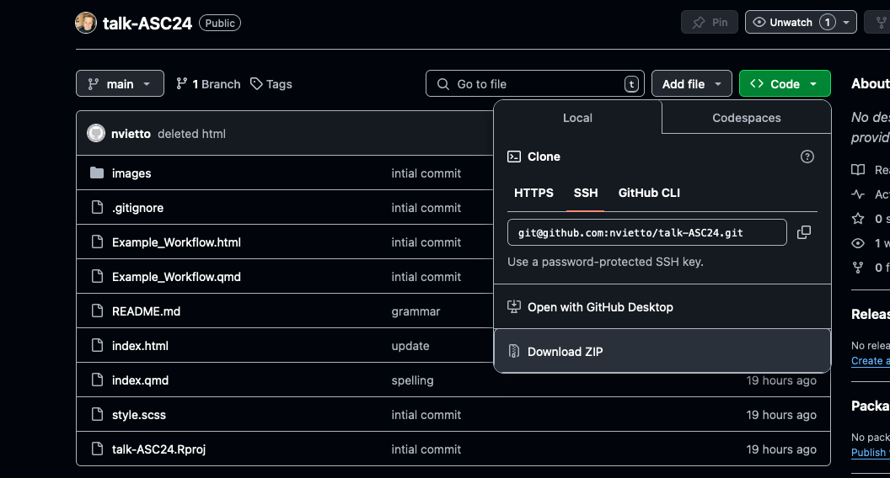

# ASC 2024 Meeting in San Francisco  

## A Combined Theory and Data-Driven Approach to Classifying Delinquency Risk in the Future of Families and Child Well-Being Study  

### Session: Advancing Methodological Approaches to Biopsychosocial Research  

📍 **Time and Location:** Thu, Nov 14, 2:00 - 3:20 pm, Salon 1 - Lower B2 Level  

---

## How to Download the Files

Click the green "Code" button and select "Download ZIP" to download all files.

## Repository Contents

- **index.html / index.qmd**: Presentation slides (use the HTML version).
- **Example_Workflow.html / Example_Workflow.qmd**: A simple example of a neural network workflow. This includes simulated data, and libraries are set to auto-install if missing. Simply open and select "Render" to get started.

--- 
